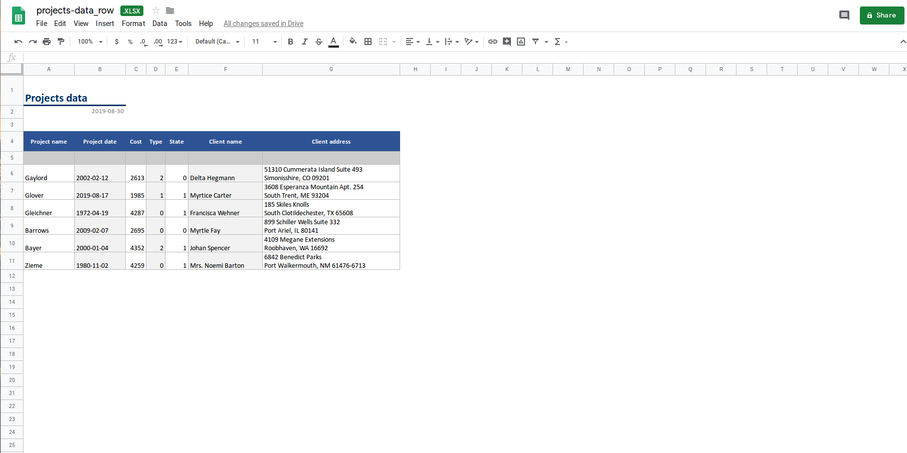

# ExcelReport

[](https://packagist.org/packages/lab36/excel-report)
[](https://packagist.org/packages/lab36/excel-report)


This package allows you to generate Microsoft Excel files from any collection or array. You can easily apply formatting, styles or themes. It comes bundled with beautiful themes ready to use.

This php library is a wrapper around [PhpSpreadsheet](https://phpspreadsheet.readthedocs.io/en/latest/) library.

## Motivation
We needed to export beautiful excel reports and with as little boilerplate as possible. PhpSpreadsheet does a good job working with excel files and we needed something on top just to avoid the repetitive work.

## ✨ Features

- **Easily export collection/array to Excel.** Take your Laravel collection/array and export them directly to an Excel document.

- **Beautiful themes ready to go.** Beautiful templates easy customizable already prepared for you.

- **Customize any cell.** Hooks to easily customize any cell based on values or coordinates.

## Basic Usage

```bash
composer require excel-report/excel-report
```

Just create a file in anywhere in your app folder or use an artisan command:

```bash
php artisan excel:report ProjectDetailsExcelReport
```
This by default will create the file ProjectDetailsExcelReport.php with folder app\ExcelReport.
```php
<?php
namespace App\ExcelReport;

use Lab36\ExcelReport\ExcelReport;

class ProjectDetailsExcelReport extends ExcelReport
{
    public function columnMappings(): array
    {
        return [
            'project' => 'Project name',
            'start_date' => 'Project date',
            'cost' => 'Cost',
            'type' => 'Type',
            'state'=> 'State',
            'client_name'=>'Client name',
            'client_address'=>'Client address',
        ];
    }
}

```
In your controller:
```php
<?php

namespace App\Http\Controllers;

use App\ExcelReport\ProjectDetailsExcelReport;
use App\Http\Controllers\Controller;
use Faker\Factory;


class ReportController extends Controller
{
    public function exportProjects()
    {
        $faker = Factory::create();

         $project_data = collect([
            [
                'project' => $faker->lastName,
                'start_date' => $faker->date('Y-m-d'),
                'cost' => $faker->numberBetween(2500, 3000),
                'type' => $faker->numberBetween(0, 3),
                'state'=> $faker->numberBetween(0,1),
                'client_name'=>$faker->name,
                'client_address'=>$faker->address,
            ],
            [
                'project' => $faker->lastName,
                'start_date' => $faker->date('Y-m-d'),
                'cost' => $faker->numberBetween(1000, 2000),
                'type' => $faker->numberBetween(0, 3),
                'state'=> $faker->numberBetween(0,1),
                'client_name'=>$faker->name,
                'client_address'=>$faker->address,
            ],
            [
                'project' => $faker->lastName,
                'start_date' => $faker->date('Y-m-d'),
                'cost' => $faker->numberBetween(4200, 4500),
                'type' => $faker->numberBetween(0, 3),
                'state'=> $faker->numberBetween(0,1),
                'client_name'=>$faker->name,
                'client_address'=>$faker->address,
            ],
        ]);

     
        return ProjectDetailsExcelReport::fromCollection(
             'Project details',
             $project_data
        )->download();
    }
}
```



## Installation

You can install the package via composer:

```bash
composer require excel-report/excel-report
```
and then publish the config

```bash
php artisan vendor:publish --provider="Lab36\ExcelReport\ExcelReportServiceProvider"
```

## Options
First thing you need the ExcelReport file. It's just a php class that extends ExcelReport. You can use 
```bash
php artisan excel:report ClassName
```

### Column mappings
The ExcelReport file must have a columnMappings function.
This function maps array/collection values to Spreadsheet columns.

Exemple:
Let's say we have an array
```php
 $employee_data = [
        [
            'name' => $faker->name,
            'start_date' => $faker->date('Y-m-d'),
            'employee_cost' => $faker->numberBetween(100, 200),
        ],
        [
            'name' => $faker->name,
            'start_date' => $faker->date('Y-m-d'),
            'employee_cost' => $faker->numberBetween(100, 200),
        ],
    ];

```
the columnMappings function would be: 
```php
public function columnMappings(): array
    {
        return [
            'name' => __('Name'),
            'start_date' => 'Start date',
            'employee_cost' => 'Employee cost',
        ];
    }
```
columnMappings values would become the header for the excel report. If you want to ignore a column from the array just omit it from columnMappings. You can also use translations here. 

### Column alignment
By default PhpSpreadsheet does a good job aligning data. If you want to provide some exceptions you can implement columnAlignment function and specify the alignment.
 
 Possible values:
- LEFT
- RIGHT
- CENTER
- HORIZONTAL_GENERAL
- HORIZONTAL_LEFT
- HORIZONTAL_RIGHT
- HORIZONTAL_CENTER
- HORIZONTAL_CENTER_CONTINUOUS
- HORIZONTAL_JUSTIFY
- HORIZONTAL_FILL
- HORIZONTAL_DISTRIBUTED
      
```php

    public function columnAlignment(): array
    {
        return [
            'start_date' => 'CENTER',
        ];
    }
```
You can specify only the columns for which you need to change the alignment.
### Column formats
You can specify column formats by implementing the function columnFormats

- NUMERIC
- TEXT
- DATE_DD-MM-YYYY
- NUMERIC_FORMATTED
- DATE_YYYY-MM-DD
- CURRENCY_LEI
- FORMAT_GENERAL
- FORMAT_TEXT
- FORMAT_NUMBER
- FORMAT_NUMBER_00
- FORMAT_NUMBER_COMMA_SEPARATED1::FORMAT_NUMBER_COMMA_SEPARATED1,
- FORMAT_NUMBER_COMMA_SEPARATED2::FORMAT_NUMBER_COMMA_SEPARATED2,
- FORMAT_PERCENTAGE
- FORMAT_PERCENTAGE_00
- FORMAT_DATE_YYYYMMDD2
- FORMAT_DATE_YYYYMMDD
- FORMAT_DATE_DDMMYYYY
- FORMAT_DATE_DMYSLASH
- FORMAT_DATE_DMYMINUS
- FORMAT_DATE_DMMINUS
- FORMAT_DATE_MYMINUS
- FORMAT_DATE_XLSX14
- FORMAT_DATE_XLSX15
- FORMAT_DATE_XLSX16
- FORMAT_DATE_XLSX17
- FORMAT_DATE_XLSX22
- FORMAT_DATE_DATETIME
- FORMAT_DATE_TIME1
- FORMAT_DATE_TIME2
- FORMAT_DATE_TIME3
- FORMAT_DATE_TIME4
- FORMAT_DATE_TIME5
- FORMAT_DATE_TIME6
- FORMAT_DATE_TIME7
- FORMAT_DATE_TIME8
- FORMAT_DATE_YYYYMMDDSLASH
- FORMAT_CURRENCY_USD_SIMPLE
- FORMAT_CURRENCY_USD
- FORMAT_CURRENCY_EUR_SIMPLE
- FORMAT_CURRENCY_EUR

```php
    public function columnFormats(): array
    {
        return [
            'start_date' => 'DATE_YYYY-MM-DD',
            'employee_cost' => 'NUMERIC_FORMATTED',
        ];
    }
```

You can also specify any PhpSpreadsheet format by using the function addColumnFormats(), which will merge default formats with the one specified.

 
### Column width
You can define any custom column width in character units implementing the following function.
```php
    public function columnWidth(): array
    {
        return [
            'name' => '40',
        ];
    }
```
By default PhpSpreadsheet tries to guess the correct width for the column but there are cases when they become too long so we need to adjust. When a column gets smaller width, data in that column will wrap. Depending on your settings (default_row_height) rows will adjust to wrapping. 

### Special row positioning
You can override the default positioning for title, header and filters. For this you must call the coresponding setters. 

In your Controller you can have  
```php
 return ProjectDetailsExcelReport::fromCollection(
             'Project details',
             $project_data
        )
        ->setTitleRowNo(2)
        ->setFilterRowNo(5)
        ->setHeaderRowNo(6)
        ->download();
```

### Choosing a theme
This package comes with two themes. The default theme is set in the config file. 
You can create other themes by implementing **ExcelThemeInterface**.  

### Filter reports
This filters represent the values used to obtain data for the report. If the filter doesn't have a corresponding column it will appear after the last column.

Filters are an array in form: 

[column_name => filter_value, ...]

```php
$project_data = Project::where('name','=','John')
                        ->where('start_date', '=', '2018-01-01')
                        ->get();

return ProjectDetailsExcelReport::fromCollection(
                                                 'Project details',
                                                 $project_data)
                                ->setFilters([
                                            'name' => 'John',
                                            'start_date' => '2018-01-01',
                                            ])
                                ->download();
```


### Download/store
You can choose to download or store on the server the created file. You can provide the file name to be used.

```php
return ProjectDetailsExcelReport::fromCollection(
                                                 'Project details',
                                                 $project_data)
                                ->download('Project details '.Carbon::now()->toDateString());
```
To store the file you must specify the path

```php
return ProjectDetailsExcelReport::fromCollection(
                                                 'Project details',
                                                 $project_data)
                                ->store('Project details '.Carbon::now()->toDateString(), public_path());
```


### OverrideCell
To override any cell of the report you can implement the overrideCell method in you ExcelReport file with the following parameters:

- active_sheet
- current_row_no
- column_no
- value
- row_data
- column_name


```php
public function overrideCell(Worksheet $active_sheet, int $current_row_no, int $column_no, string $value, array $row_data, string $column_name)
{
    if ($column_name == 'order_type' && is_numeric($value)) {
        $active_sheet->setCellValue(Coordinate::stringFromColumnIndex($column_no).$current_row_no,
                                    config('enums.order_type')[$value]);
    }
}
```
Here you can override data, formatting, styling, alignment, etc. You can use any PhpSpreadsheet function available for the active sheet.

### Config file
In the config file you can define
- excel file metadata 
- namespace used for artisan command
- default theme
- default row height


## Changelog

Please see [CHANGELOG](CHANGELOG.md) for more information what has changed recently.

## Contributing

Please see [CONTRIBUTING](CONTRIBUTING.md) for details.

## Credits

- [Lab36](https://github.com/lab36)
- Cosmin Natea
- Andrea Molnar
- [All Contributors](../../contributors)

## License

The MIT License (MIT). Please see [License File](LICENSE.md) for more information.
